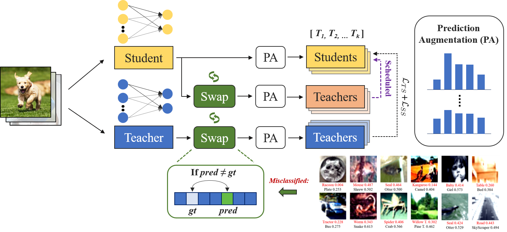

## Swapped-Logit-Distillation (Multimedia Systems 2025).

### Installation

Environments:

- Python 3.8
- PyTorch 1.7.0

Install the package:

```
sudo pip3 install -r requirements.txt
sudo python3 setup.py develop
```

### SLD Framework

<div style="text-align:center"></div>

### CIFAR-100


- Download the `cifar_teachers.tar` at <https://github.com/megvii-research/mdistiller/releases/tag/checkpoints> and untar it to `./download_ckpts` via `tar xvf cifar_teachers.tar`.

  ```bash
  python3 tools/train_ours.py --cfg configs/cifar100/SLD/res32x4_res8x4.yaml 
  ```

### Training on ImageNet

- Download the dataset at <https://image-net.org/> and put them to `./data/imagenet`

  ```bash
  python3 tools/train_ours.py --cfg configs/imagenet/r34_r18/kd_ours.yaml
  ```

# Acknowledgement
Thank you for the contributors to the mdistiller codebase. The code is built on [mdistiller](<https://github.com/megvii-research/mdistiller>).

# Citation

If this repo is helpful for your research, please consider citing the paper:

```BibTeX
@article{limantoro2025sld,
  title={Swapped logit distillation via bi-level teachers alignment},
  author={Limantoro, Stephen Ekaputra and Lin, Jhe-Hao and Wang, Chih-Yu and Tsai, Yi-Lung and Shuai, Hong-Han and Huang, Ching-Chun and Cheng, Wen-Huang},
  journal={Multimedia Systems},
  volume={x},
  number={x},
  pages={x},
  year={2025},
  publisher={Springer}
}
```

# Contact
[Stephen][(https://github.com/StephenEkaputra)]: stephenekaputra@gmail.com
