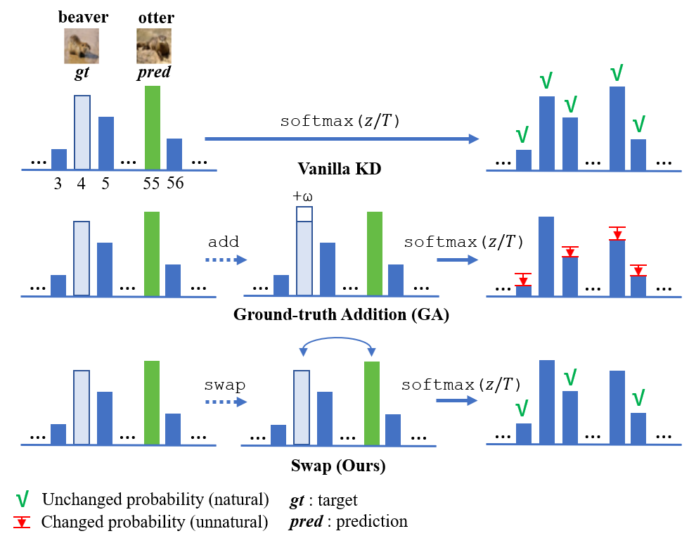

## Swapped Logit Distillation via Bi-Level Teacher Alignment

<div style="text-align:center"></div>

### Abstract

Knowledge distillation (KD) compresses the network capacity by transferring knowledge from a large (teacher) network to a smaller one (student). It has been mainstream that the teacher directly transfers knowledge to the student with its original distribution, which can possibly lead to incorrect predictions. In this article, we propose a logit-based distillation via swapped logit processing, namely Swapped Logit Distillation (SLD). SLD is proposed under two assumptions: (1) the wrong prediction occurs when the prediction label confidence is not the maximum; (2) the “natural” limit of probability remains uncertain as the best value addition to the target cannot be determined. To address these issues, we propose a swapped logit processing scheme. Through this approach, we find that the swap method can be effectively extended to teacher and student outputs, transforming into two teachers. We further introduce loss scheduling to boost the performance of two teachers' alignment. Extensive experiments on image classification tasks demonstrate that SLD consistently performs best among previous state-of-the-art methods.

### Installation

Environments:

- Python 3.8
- PyTorch 1.7.0

Install the package:

```
sudo pip3 install -r requirements.txt
sudo python3 setup.py develop
```

### SLD Framework

<div style="text-align:center"></div>

### CIFAR-100


- Download the `cifar_teachers.tar` at <https://github.com/megvii-research/mdistiller/releases/tag/checkpoints> and untar it to `./download_ckpts` via `tar xvf cifar_teachers.tar`.

  ```bash
  python3 tools/train_ours.py --cfg configs/cifar100/SLD/res32x4_res8x4.yaml 
  ```

### Training on ImageNet

- Download the dataset at <https://image-net.org/> and put them to `./data/imagenet`

  ```bash
  python3 tools/train_ours.py --cfg configs/imagenet/r34_r18/sld.yaml
  ```

# Acknowledgement
Thanks for the contributions to the codebase. The code is built on [mdistiller](<https://github.com/megvii-research/mdistiller>) and [mlkd](<https://github.com/Jin-Ying/Multi-Level-Logit-Distillation>).

# Contact

Stephen: stephenekaputra@gmail.com

# Citation

If this repo is helpful for your research, please consider citing the paper:

```BibTeX

@article{limantoro2025sld,
  title={Swapped logit distillation via bi-level teacher alignment},
  author={Limantoro, Stephen Ekaputra and Lin, Jhe-Hao and Wang, Chih-Yu and Tsai, Yi-Lung and Shuai, Hong-Han and Huang, Ching-Chun and Cheng, Wen-Huang},
  journal={arXiv preprint arXiv:x},
  year={2025}
}
```
